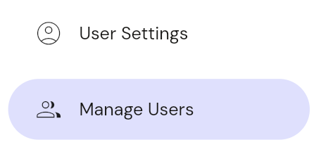
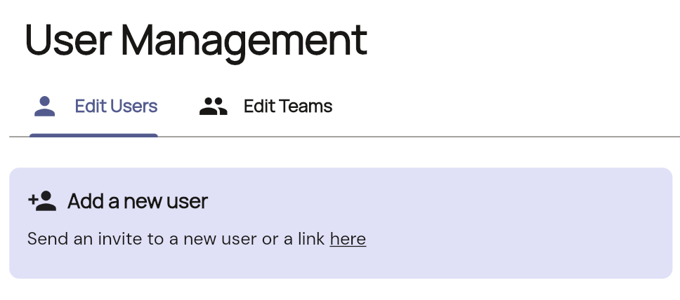
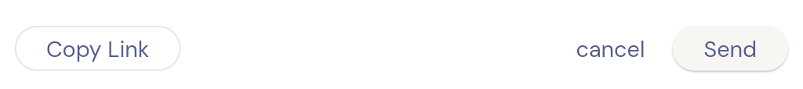

# Creating a user

1.  **Navigate to the user page:**
    Choose user management from the left hand nav.
    

2.  **Tap on the add new user:**
    
    

3.  **Send or Copy Onboarding Link:**
    A pop-up will appear, allowing you to send an email invitation to the new user's email address. Alternatively, you can click "Copy Link" to retrieve the onboarding link and share it manually.
    

    Selecting *Send* will send an onboarding link to the new user, where they can go through the steps to create their Adapt Apps account.

    **Note:** Email functionality for sending onboarding links is currently under development and will be available soon. For now, please use the *Copy Link* feature and share it directly with the users you wish to add.